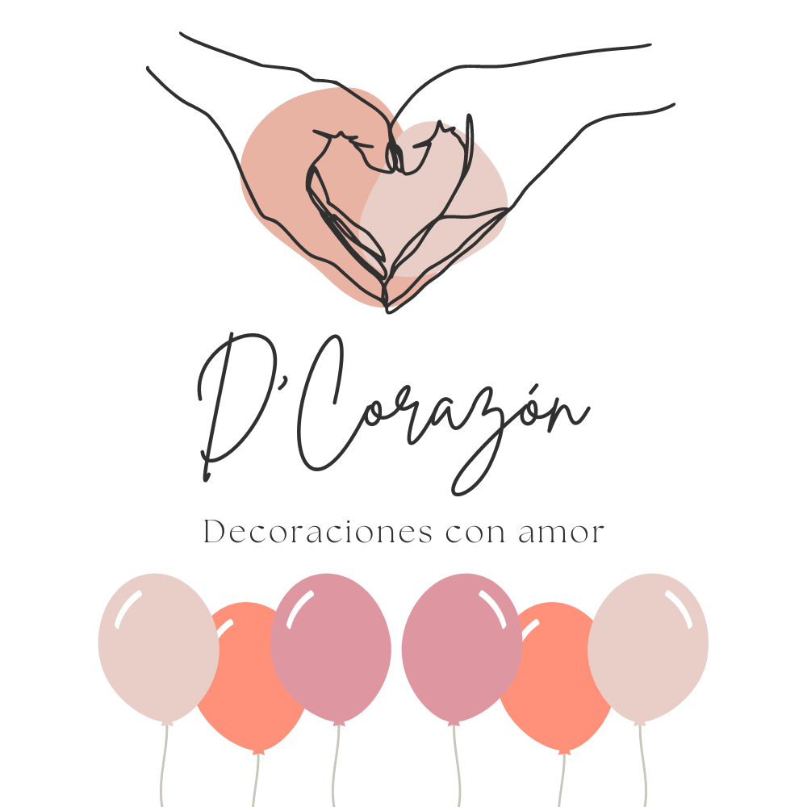

**Decorazón** es una plataforma web para la gestión y presentación de servicios de decoración de eventos.  
El proyecto está orientado a facilitar la creación, organización y difusión de celebraciones personalizadas como:

- Baby showers
- Cumpleaños
- Revelaciones de género
- Decoraciones temáticas
- Eventos especiales

## Sobre la empresa

Decorazón es una empresa ubicada en **Gran Canaria** especializada en:
- Decoraciones con globos
- Montajes personalizados para eventos
- Papelería personalizada
- Detalles únicos para celebraciones

Su filosofía se centra en crear momentos memorables con diseños únicos y un toque hecho con amor.

## Funcionalidades de la web

- Catálogo visual de eventos realizados
- Formulario de contacto para solicitudes y presupuestos
- Galerías por tipo de evento
- Información sobre servicios y paquetes
- Posibilidad de personalizar y solicitar montajes

## Tecnologías utilizadas

- HTML5, CSS3, JavaScript, Typescript
- Astro.js
- Tailwind CSS

## Estado del proyecto

En desarrollo / versión interna.  
El repositorio es **privado** para proteger el código y recursos de la empresa.

## Contacto

📩 **Email:** decorazonlaspalmas@gmail.com  
📍 **Ubicación:** Gran Canaria, España  
📷 **Instagram:** [@decorazonlp](https://www.instagram.com/decorazonlp)
